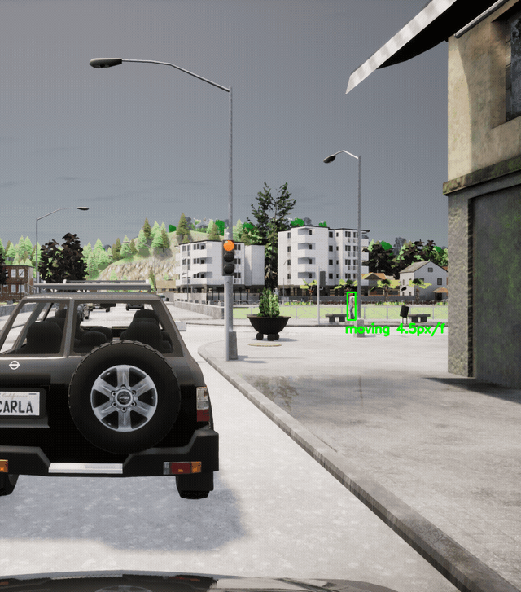

# Vision-Based Pedestrian Intention Prediction for Autonomous Navigation

Detect pedestrians and estimate their short-term motion behaviour (moving
/ stationary) from synthetic urban driving data generated with the
**CARLA** simulator (Town01). A **YOLOv8** RGB detector is paired with a
**semantic-segmentation** fallback to recover the small/occluded
pedestrians YOLO misses, the two streams are merged by IoU, and each
tracked pedestrian is classified as moving or stationary using either
dense optical flow or IoU-based centroid speed.

Course project for CSE 573 - Computer Vision and Image Processing,
University at Buffalo, Spring 2025. Full write-up in
[`docs/CVIP_final_report.pdf`](docs/CVIP_final_report.pdf).



*Pipeline output on a real CARLA Town01 sequence (ego-vehicle view). Each
tracked pedestrian gets a track ID and a short-term intent label - green =
moving, red = stationary - with its pixel speed.*

## Pipeline

```
   images_rgb/*.png                 images_ss/*.png
        |                                 |
        v                                 v
   src/detection_yolo.py             src/detection_ss.py
   (YOLOv8 + CLAHE + gamma)          (color mask + morphology)
        |                                 |
        +---------> src/merge_detections.py <---------+
                            |
                            v
              +-------------+-------------+
              |                           |
              v                           v
      src/intent_flow.py           src/intent_tracker.py
      (Farneback dense flow)       (IoU tracker + centroid speed)
              |                           |
              +--> src/visualize_intent.py --> annotated frames
```

Each stage writes per-frame JSON, so you can plug in your own detector
or intent classifier at any point.

## Approach

Following the report, the pipeline is built in four parts:

1. **RGB detection** - YOLOv8 (large model) run on enhanced frames.
   Pre-processing: CLAHE in LAB space, gamma correction (γ = 1.3), a 3×3
   sharpening kernel, and bilateral filtering. Detection uses a
   confidence threshold of 0.25, an IoU/NMS threshold of 0.45, and
   test-time augmentation (horizontal flips + scaling).
2. **Semantic-segmentation detection** - CARLA paints pedestrians a fixed
   red, so a colour threshold (with tolerance) + morphological
   close/open + connected-components analysis recovers pixel-accurate
   boxes for pedestrians YOLO misses (small, distant, or occluded).
3. **Merging** - for each frame the YOLO and SS boxes are compared by
   Intersection-over-Union; any SS box that does not overlap a YOLO box
   (IoU < 0.5) is added as a previously missed pedestrian.
4. **Intent prediction** - two interchangeable classifiers:
   - *Optical flow*: dense Farneback flow between consecutive frames;
     mean flow magnitude inside each box above **0.5 px/frame** ⇒ moving.
   - *Tracker*: an IoU tracker assigns track IDs, and per-track centroid
     pixel speed above a threshold ⇒ moving.

**Data.** RGB + semantic-segmentation frames from CARLA Town01, captured
by two synchronised cameras on a moving vehicle at 1392×1024, 72° FoV,
10 Hz. Paired filenames (`XXXX_0.png` RGB ↔ `XXXX_10.png` SS) keep the
two streams aligned.

## Repository layout

```
.
|-- README.md
|-- LICENSE                          # MIT
|-- requirements.txt
|-- src/                             # all pipeline code lives here
|   |-- common.py                    # Shared helpers (enhance_image, compute_iou)
|   |-- detection_yolo.py            # Stage 1: YOLOv8 on RGB (CLAHE + sharpen)
|   |-- detection_ss.py              # Stage 2: pedestrian mask on semantic seg
|   |-- merge_detections.py          # Stage 3: IoU-based union of both streams
|   |-- intent_flow.py               # Stage 4a: Farneback flow inside each bbox
|   |-- intent_tracker.py            # Stage 4b: IoU tracker + pixel speed
|   |-- visualize_intent.py          # Overlay intent (green/red) on RGB
|   |-- vo_monocular.py              # Bonus: monocular visual odometry
|   |-- run_real_pipeline.py         # One-shot driver for a CARLA slice
|   |-- generate_demo.py             # Synthetic frames for smoke-testing
|   |-- evaluate_demo.py             # Score intent methods vs known GT
|   `-- make_demo_video.py           # Stitch frames -> mp4/gif
|-- docs/
|   |-- DEMO.md                      # Synthetic-demo run instructions
|   |-- REAL_DATA_RESULTS.md         # Real CARLA-run numbers and caveats
|   `-- CVIP_final_report.pdf        # Full course report
`-- outputs/
    |-- demo/                        # Synthetic demo outputs (committed)
    `-- real_run/                    # Real CARLA-slice outputs (committed)
```

Not committed (either regenerable or too large): `data/`, `runs/`,
YOLO weights (`*.pt`), giant PNG intermediates under `outputs/*/`.

## Install

```bash
pip install -r requirements.txt
```

Weights are not committed. Download once from the Ultralytics releases,
then drop them anywhere on your `PATH` or pass `--yolo_weights <path>`
(default `yolov8s.pt`).

## Two ways to run

Both are driven from the repo root - the scripts figure out their own
default paths.

### 1) Synthetic demo (no data needed)

Renders a 30-frame scene with four pedestrians (two moving, one
stationary, one that starts stationary then walks) and runs the full
pipeline against it. Useful for smoke-testing the code and reproducing
the numbers below.

```bash
python src/generate_demo.py
python src/intent_flow.py \
    --img_dir outputs/demo/merged_images \
    --json_dir outputs/demo/merged_detections \
    --out_json_dir outputs/demo/intent_with_flow \
    --viz_dir outputs/demo/merged_visual_flow_final
python src/intent_tracker.py \
    --merged_dir outputs/demo/merged_detections \
    --out_dir outputs/demo/intent_predictions \
    --speed_thresh 2.0
python src/evaluate_demo.py
```

Latest run (`outputs/demo/results_summary.json`):

| method          | preds | correct | accuracy |
|-----------------|-------|---------|----------|
| tracker-based   |  120  |  117    |  0.9750  |
| flow-based      |  116  |  116    |  1.0000  |

Details and expected scene labels: [`docs/DEMO.md`](docs/DEMO.md).

### 2) Real CARLA data

Drop paired RGB + semantic-segmentation frames into
`data/images_rgb/` and `data/images_ss/` using the CARLA-KITTI naming
convention:

- `XXXX_0.png` (RGB) is paired with `XXXX_10.png` (SS)
- `XXXX_1.png` (RGB) is paired with `XXXX_11.png` (SS)

Then run the driver:

```bash
python src/run_real_pipeline.py --start 1644 --count 23 --suffix 0
```

Results from the committed run on 23 Town01 frames
(`outputs/real_run/results_summary.json`):

| stage                              | count |
|------------------------------------|-------|
| YOLO detections                    | 30    |
| SS detections                      | 29    |
| Merged detections                  | 52    |
| SS-only additions                  | 22    |
| Flow-based moving / stationary     | 28 / 22 |
| Tracker-based moving / stationary  | 20 / 32 |
| Tracker unique track IDs           | 9     |

Full commentary (including the ego-motion caveat): [`docs/REAL_DATA_RESULTS.md`](docs/REAL_DATA_RESULTS.md).

### Detection at scale

Across the full Town01 collection the RGB+SS detector was run on **10,000
frames** and found pedestrians in **8,979** of them (**12,310** total
pedestrians), for roughly **73% detection accuracy** - see the report for
the complete evaluation.

### Known limitations

- **Small / distant pedestrians** only span a few pixels and are the main
  source of missed detections; the SS fallback recovers many but not all.
- **Vertical high-contrast objects** - dustbins, poles, and thin
  tree trunks - can be misclassified as pedestrians by the RGB detector.
  You will see this in the raw real-run frames (a roadside dustbin picked
  up as a stationary "pedestrian"); tightening the confidence threshold
  or adding an SS-mask cross-check reduces it.
- **Ego-motion**: intent is measured in pixel space, so a moving camera
  adds apparent motion to static pedestrians (see the ego-motion caveat
  in the real-data notes).

## Getting CARLA data

- **KITTI-CARLA** pre-recorded dataset (fastest way to get started with
  paired RGB + SS): https://github.com/jedeschaud/kitti_carla_simulator
- **CARLA-KITTI generator** if you want your own scenarios:
  https://github.com/fnozarian/CARLA-KITTI
- **CARLA simulator**, pre-built Linux release:
  https://github.com/carla-simulator/carla/releases

## References

The full reference list from the report:

- Dosovitskiy et al., *CARLA: An Open Urban Driving Simulator*, CoRL 2017.
- Rasouli, Kotseruba & Tsotsos, *Pedestrian Action and Intention
  Recognition: A Visual Perspective*, IEEE ITSC 2019.
- Ultralytics, *YOLOv8 Object Detection Models*, GitHub 2023 -
  https://github.com/ultralytics/ultralytics
- Farnebäck, *Two-Frame Motion Estimation Based on Polynomial Expansion*,
  SCIA 2003.
- Zhang et al., *Exploring CARLA for Semantic Segmentation: Benchmarks and
  Challenges*, IEEE IV 2021.
- CARLA-KITTI synthetic-data generators: fnozarian/CARLA-KITTI and
  jedeschaud/kitti_carla_simulator (arXiv:2109.00892).

## License

[MIT](LICENSE).
